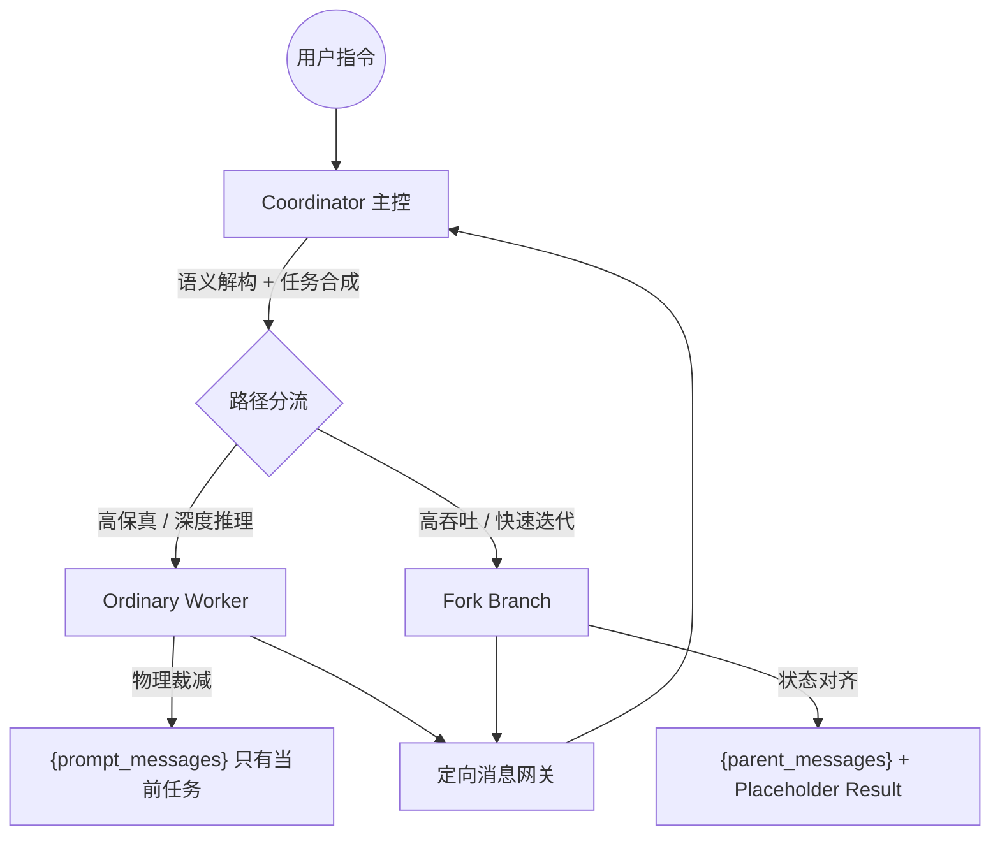

在 AI Engineering 领域，多智能体（Multi-Agent）系统的真正陷阱在于**“语义熵增”**。

当系统需要处理数万行复杂的工程上下文时，如何防止 AI 在海量代码中“迷路”？如何在并发分析多个模块时，保持逻辑的强一致性？Claude Code 的答案并非仅仅依靠强大的模型，而是一套严密、物理隔离的**隔离哲学**。

通过拆解其底层逻辑，我们可以看到一种对**上下文纯度（Context Purity）**近乎偏执的控制。这种控制不再停留在提示词层面的“口头约定”，而是深入到数据的初始化物理路径。

---

## 1. 物理隔离：为什么“零初始上下文”是降噪的终极手段？

在源码阅读场景下，“上下文噪音”是推理质量的第一杀手。随着 Token 数的增加，模型的注意力分散效应（Lost in the Middle）会指数级增强。Claude Code 拒绝在提示词中嘱咐模型“请忽略无关信息”，它认为**模型的时间不应浪费在“过滤”上，而应全部投入到“推理”中**。



### 隔离的物理实现
子代理（Worker）在起跑时，其 `contextMessages` 被强制设置为**空数组**。这意味着 Worker 处于一种“无记忆”状态，它唯一的真理就是主控节点刚刚合成的任务说明（Self-contained Prompt）。

```ts
// 路径分发逻辑：强制上下文物理隔离
const contextMessages: Message[] = forkContextMessages
  ? filterIncompleteToolCalls(forkContextMessages)
  : [] // 普通路径：上下文强制设为空数组

const initialMessages: Message[] = [...contextMessages, ...promptMessages]

const agentReadFileState =
  forkContextMessages !== undefined
    ? cloneFileStateCache(toolUseContext.readFileState)
    : createFileStateCacheWithSizeLimit(READ_FILE_STATE_CACHE_SIZE)
```

**架构洞察**：这种“物理降噪”彻底解决了多层级 Agent 系统中最致命的**隐式偏见传递**。在一个没有历史负载的 Worker 中，所有的逻辑决策均基于主控给出的“唯一输入”，从而让局部代码分析的稳定性提升了数倍。

---

## 2. 语义总线：Coordinator 如何承担“熵减”？

在 Claude Code 的体系中，Coordinator (主控节点) 承担了“语义总线”与“翻译官”的双重角色。

在很多 Multi-Agent 架构中，系统通过转发 Agent A 的回复给 Agent B 来实现协作。这种设计极易导致多轮调用后的**语义退化**。而 Claude Code 强制要求 Coordinator 在每一轮续派任务之前，必须对子代理返回的局部发现（Findings）进行一次**语义重写**。

主控节点必须将非结构化的调查报告，转化为具备强确定性的自包含指令。这种语义压缩不仅降低了 Token 成本，更重要的是它强制 Coordinator 进行了“状态核准”：如果 Worker 发现了一个路径错误，Coordinator 必须将这个错误转化为绝对路径后再派发给下一个 Worker。这种设计确保了复杂任务下指令流的原子性。

---

## 3. 缓存经济学：Isolation 与 Prompt Cache 的权衡

绝对的隔离意味着**冷启动代价**。如果每个子代理都从零起跑，模型必须重新解析系统提示词与基础工程信息，这不仅慢，而且昂贵。

为此，Claude Code 引入了 **Fork 路径**。它的核心策略是通过“字节级对齐”来换取 Prompt Cache 的命中。

```ts
// 为了命中缓存，Fork 会保留完整的消息前缀并补齐占位符
export function buildForkedMessages(
  directive: string,
  assistantMessage: AssistantMessage,
): MessageType[] {
  const toolResultBlocks = assistantMessage.message.content.filter(
    (block): block is BetaToolUseBlock => block.type === 'tool_use',
  )
  const toolResultBlocksFinal = toolResultBlocks.map(block => ({
    type: 'tool_result' as const,
    tool_use_id: block.id,
    content: [{ type: 'text', text: FORK_PLACEHOLDER_RESULT }],
  }))
  // 保持字节级对齐以触发模型侧缓存
}
```

通过伪造 `tool_result` 占窗，Claude Code 让即便逻辑已经发生分支的子任务，其首部的 API 请求序列依然保持稳定。这证明了在工业级设计中，可以通过**分流执行（Bifurcation）**来实现执行纯度与执行成本的动态平衡。

---

## 4. 回流闸门：分布式任务的副作用控制

源码分析系统的另一个核心挑战是：**谁动了我的工作副本？**。

当并发运行多个 Agent 时，文件系统的冲突是不可避免的。Claude Code 采用了三层流控来解决副作用的污染问题：

1.  **Scratchpad (暂存区)**：Worker 只允许在 Session 特定的暂存目录写入临时产物（如扫描出的 JSON），从而保护了用户项目主目录的纯净。
2.  **独立 Worktree**：Fork 路径的 Worker 运行在独立的 Git 工作树中。这种物理层面的隔离，确保了父子 Agent 即便共享了上下文，其产生的读写冲突也被强行解耦。
3.  **结果定向解析**：回流结果被严格包装成 XML 结构化通知，主控节点只接收经过 Regex 匹配过滤后的结论。

```ts
// 结果回传：XML 结构化通知过滤与逻辑入队
if (command.mode === 'task-notification') {
  const notificationText = typeof command.value === 'string' ? command.value : ''
  const taskIdMatch = notificationText.match(/<task-id>([^<]+)<\/task-id>/)
  const statusMatch = notificationText.match(/<status>([^<]+)<\/status>/)
  const summaryMatch = notificationText.match(/<summary>([^<]+)<\/summary>/)
  
  output.enqueue({
    type: 'system',
    subtype: 'task_notification',
    task_id: taskIdMatch?.[1] ?? '',
    status: statusMatch?.[1] ?? 'unknown',
    summary: summaryMatch?.[1] ?? '',
  })
}
```

---

## 5. 结语：工业级源码阅读系统的核心启示

通过对 Claude Code 源码的复盘，我们可以发现其 Agent 架构向工业级演进的三个核心范式：

*   **隔离优于博弈**：不要指望模型在噪音中做对，要通过架构剥离噪音。
*   **压缩优于直传**：任何跨 Agent 的通信都必须经过一次“语义熵减”。
*   **分支换取缓存**：在追求一致性的分支任务中，牺牲部分隔离度来获取更高的缓存命中。

这正是 Claude Code 最具价值的地方：它不再玩弄复杂的 Prompt 技巧，而是用一套严丝合缝的工程方案，解决了大模型在处理海量项目上下文时的逻辑发散。
