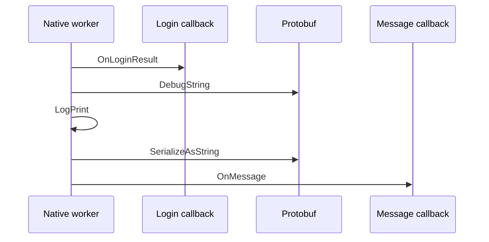

两个回调由同一个工作线程顺序触发，前一个回调已经执行，后一个回调却总要晚约 40 ms。桥接层、事件分发和锁都检查过，延迟仍然存在。

这类问题很容易被归因于线程调度或跨语言通信，但「顺序执行」只说明先后关系，并不代表两个调用紧挨着。只要中间夹着一次同步的对象格式化、日志输出或序列化，后一个回调就必须等待。

最后改变判断的是 SO 中的一段调用顺序：

```text
OnLoginResult(...)
message.DebugString()
LogPrint(...)
root.SerializeAsString()
OnMessage(...)
```

一次用于调试的 Protobuf 文本化操作，正好位于两个回调之间。临时绕过这段代码后，间隔从约 40 ms 降到 0.1～0.3 ms。

本文以这个经过脱敏的案例介绍 Ghidra：它适合解决什么问题，如何从一个运行时现象定位到 SO 中的具体调用，以及怎样避免把符号、字符串和真实调用次数混为一谈。文中的库名、函数名、路径、地址和性能数据均已泛化，不对应任何线上服务或真实业务配置。

## Ghidra 解决的不是「看汇编」

[Ghidra](https://github.com/NationalSecurityAgency/ghidra) 是美国国家安全局开源的逆向工程工具集，支持 ELF、PE、Mach-O 等常见二进制格式，也覆盖 ARM、AArch64、x86、MIPS 等多种指令集。

它最有价值的部分不是反汇编本身，而是把几类信息组织到一起：

- **Listing**：显示机器指令、地址、数据和交叉引用；
- **Decompiler**：把机器指令恢复成接近 C 的伪代码；
- **Symbol Tree**：集中查看函数、导入符号和导出符号；
- **Defined Strings**：从日志文案、错误信息等常量反查使用位置；
- **XREF**：查看某个函数或字符串被哪些位置引用。

反汇编回答「处理器执行了什么」，反编译回答「这段逻辑大致在做什么」，交叉引用回答「谁调用了它」。三者结合，才能把运行时现象和二进制实现联系起来。

Ghidra 也不是源码恢复器。变量名、类型、宏、注释以及部分控制结构在编译后已经丢失，Decompiler 展示的是分析结果，不是原始 C++。优化级别越高、符号裁剪越彻底，伪代码越需要结合汇编验证。

## 先做二进制体检，再打开 Ghidra

直接把一个十几兆的 SO 扔进 Ghidra，然后从第一个函数开始翻，通常效率很低。先用命令行确认文件类型、架构、符号和可疑入口，可以显著缩小分析范围。

```bash
file libnetwork_core.so
du -h libnetwork_core.so

BINUTILS="$(brew --prefix binutils)/bin"

"$BINUTILS/readelf" -h libnetwork_core.so
"$BINUTILS/readelf" -Ws libnetwork_core.so | c++filt | rg 'DebugString'
"$BINUTILS/readelf" -Wr libnetwork_core.so | c++filt | rg 'DebugString'
```

这个案例中的 SO 是带 DWARF 调试信息、未裁剪符号的 64 位 ELF，因此函数名和部分源码行号仍然可用。这样的二进制分析成本较低。如果 `file` 显示 `stripped`，仍然可以从导入函数、日志字符串、虚表和调用图入手，只是需要更多人工命名和类型修正。

需要特别注意：`strings` 适合寻找线索，不适合统计调用次数。

```bash
strings libnetwork_core.so | rg -c 'DebugString'
```

命中几十次并不代表执行了几十次。函数名可能同时出现在 `.dynsym`、`.symtab`、`.debug_info`、`.debug_str` 等区域，模板和类型信息也会重复保存。真实调用次数必须回到代码段和交叉引用中确认。

## 导入并分析 SO

macOS 可以通过 Homebrew 安装 Ghidra：

```bash
brew install --cask ghidra
java -version
ghidraRun
```

Ghidra 的 Java 版本要求会随发行版变化，安装前应核对当前版本的 [Installation Guide](https://ghidra-sre.org/InstallationGuide.html)。

首次分析可以按下面的最短流程进行：

1. 选择 `File -> New Project -> Non-Shared Project` 创建本地项目；
2. 选择 `File -> Import File` 导入 SO，确认格式识别为 ELF 和正确架构；
3. 双击文件进入 CodeBrowser，接受默认分析选项；
4. 等待 Auto Analysis 完成，再开始搜索函数和字符串。

架构识别错误会让后续反汇编全部失真。导入阶段至少要核对 ELF 位数、大小端和处理器架构。分析多个 ABI 时，应分别导入 `arm64-v8a` 和 `x86_64` 版本，不要假设两个产物的代码地址或优化结果相同。

## 从运行时延迟建立三个假设

逆向分析之前，先明确需要区分的解释。本例有三个候选原因：

1. ArkTS 或 JavaScript 桥接层排队，导致第二个回调延后；
2. 回调分发器持有锁，或者任务队列中存在等待；
3. 两个 native 回调之间执行了耗时的同步代码。

区分它们的最小证据也很明确：

- 关闭桥接层转发后延迟是否仍然存在；
- 两个回调是否来自同一线程；
- SO 内两个回调之间是否存在可疑调用；
- 绕过该调用后，延迟是否同步消失。

前两项把问题范围收缩到了 native 工作线程。接下来需要回答的不是「哪个组件可能慢」，而是「CPU 在两个回调之间实际执行了什么」。这正是 Ghidra 擅长的部分。

## 用符号和 XREF 找到调用者

如果 SO 保留了符号，可以在左侧 `Symbol Tree -> Imports` 中搜索：

```text
google::protobuf::Message::DebugString() const
```

选中该符号后，使用 `References -> Show References To` 查看所有交叉引用。案例中只出现一个业务调用者，位于消息分发函数中。

如果符号已经裁剪，可以改用日志字符串定位。选择 `Search -> For Strings`，搜索回调之间出现的日志文案，再对字符串执行 `Show References To`。日志调用附近通常能看到字符串构造、格式化函数和目标消息对象。

Decompiler 中恢复出的逻辑经过简化后类似下面这样：

```cpp
if (isLoginResponse(root)) {
    LoginResult result;
    result.ParseFromString(root.payload());

    listener->OnLoginResult(result.code());
    LogPrint("login result=%s", result.DebugString().c_str());

    OnMessage(root.SerializeAsString());
}
```

这段伪代码解释了表面上的矛盾：两个回调确实由同一个线程顺序执行，但它们中间还有完整的 Protobuf 文本化和日志输出。第二个回调没有丢失，也没有被异步调度，只是在等待前面的同步工作完成。



## 反编译之后还要核对汇编

Decompiler 适合理解逻辑，但性能问题中的调用顺序最好回到 Listing 复核。AArch64 中可能看到类似指令：

```asm
blr     x8                  ; OnLoginResult
bl      DebugString@plt
bl      LogPrint@plt
bl      SerializeAsString@plt
bl      OnMessage@plt
```

x86_64 中对应的是：

```asm
call    *%rax               # OnLoginResult
call    DebugString@plt
call    LogPrint@plt
call    SerializeAsString@plt
call    OnMessage@plt
```

这里的 `@plt` 是 Procedure Linkage Table 入口。动态链接的函数通常先经过 PLT，再由重定位表指向实际实现。

因此，用反汇编文本统计时还会遇到一个常见误判：搜索 `DebugString` 可能命中两行，一行是业务中的 `call` 或 `bl`，另一行只是 `DebugString@plt` 自身的跳板定义。它们并不是两个调用点。

较稳妥的统计口径是同时检查：

```bash
"$BINUTILS/readelf" -Ws libnetwork_core.so \
  | c++filt \
  | rg 'DebugString|ShortDebugString|Utf8DebugString'

"$BINUTILS/objdump" -drC libnetwork_core.so \
  | rg -n -C 8 'DebugString\(\) const'
```

在这个案例中，每个 ABI 都只有一个 `Message::DebugString()` 导入和一个业务调用点。符号表里看似重复的两条记录，分别来自动态符号表和完整符号表；反汇编中看似重复的两处，则分别是调用指令和 PLT 跳板。

## 为什么 DebugString 会慢

`DebugString()` 的目标是生成便于阅读的 Protobuf 文本，不是为高频转发设计紧凑的二进制结果。它通常需要：

- 通过 Reflection 或 TextFormat 遍历字段；
- 递归展开嵌套消息和 repeated 字段；
- 查询字段描述信息；
- 把数字、枚举和字节内容转换成文本；
- 处理转义、缩进和换行；
- 创建并扩容多个临时字符串。

当消息包含较多权限项、频道列表或扩展字段时，这些工作会快速累积。首次调用还可能叠加描述符初始化、动态符号解析和代码页冷启动。

日志函数本身也可能阻塞，但不能只凭直觉决定责任归属。本例中，日志已经出现到下一个回调进入之间只有约百微秒，而前一个回调到日志出现之间接近 40 ms。这组时间关系把主要耗时指向了日志参数求值阶段，也就是先执行的 `DebugString()`。

这也是 C++ 日志代码容易忽略的一点：即使日志最终被过滤，传入函数的参数通常也已经在调用前完成求值。仅在日志函数内部判断级别，不一定能省掉昂贵的字符串构造。

## 用二进制补丁验证假设，而不是交付补丁

为了确认根因，可以临时修改控制流，让程序跳过 `DebugString()` 和完整日志，再继续执行 `SerializeAsString()` 与消息回调。

不同架构的处理方式不同：

- AArch64 可以在原基本块入口写入无条件 `b`，跳到序列化代码；
- x86_64 可以使用 `jmp` 跳过目标区域，剩余字节用 `nop` 填充。

修改后应重新反汇编，确认三件事：跳转目标位于正确的指令边界；异常清理和对象析构没有被破坏；后续序列化与回调仍然可达。

这个实验将回调间隔从约 40 ms 降到 0.1～0.3 ms，同时完整消息回调仍然收到原始二进制结果。可疑代码的开关和问题现象同步变化，根因才算得到确认。

二进制补丁只适合作为定位实验。正式修复应回到 C++ 源码，例如：

```cpp
listener->OnLoginResult(result.code());

// 先转发完整回包，避免调试日志阻塞业务回调。
OnMessage(root.SerializeAsString());

// 生产环境只记录必要字段。
LogPrint("login result=%d", result.code());
```

如果必须保留完整文本日志，应放到业务回调之后，并受编译开关或日志级别控制。更重要的是，在调用 `DebugString()` 之前完成级别判断，避免关闭日志后仍然构造完整文本。

## Ghidra 分析中最容易踩的几个坑

### 把字符串出现次数当作调用次数

调试信息、符号表和代码段都会保存函数名。字符串搜索只能说明名字存在，不能说明函数被执行。调用次数需要查看 XREF、反汇编和控制流。

### 只看 Decompiler，不看 Listing

反编译器会重建 `if`、循环和局部变量，但可能误判类型、符号位或虚函数调用。涉及跳转目标、参数寄存器、调用顺序和补丁位置时，应以机器指令为准。

### 看到调用指令就认为一定可达

死代码中也可能保留完整的调用指令。修改控制流后，原来的 `DebugString()` 指令仍可能存在于 SO 中，但已经没有可达的前驱。此时「二进制里还有一条调用」和「运行时还会调用一次」是两个不同结论。

### 只分析一个 ABI

ARM64 与 x86_64 的地址、指令长度、PLT 布局和优化结果不同。一个 ABI 的结论可以帮助定位另一个 ABI，但不能直接复制补丁或地址。

### 把静态分析当作最终证明

Ghidra 能证明代码中存在某条路径，不能单独证明设备运行时一定走到该路径。完整证据仍需要运行时日志、时间戳、断点或可逆实验。

## 一套可复用的最小流程

以后再遇到闭源 SO 的回调延迟、异常分支或日志副作用，可以按下面的顺序排查：

1. 在回调入口记录单调时钟，确认延迟发生在哪两个边界之间；
2. 确认线程 ID，区分同步阻塞和异步排队；
3. 暂停上层桥接或监听器，判断问题是否仍在 native 层；
4. 用 `file`、`readelf`、`nm` 和 `objdump` 完成二进制体检；
5. 在 Ghidra 中从导入符号或日志字符串进入，查看 XREF；
6. 用 Decompiler 理解逻辑，再用 Listing 核对调用顺序；
7. 区分字符串、符号、PLT 跳板、调用点和运行时可达调用；
8. 用可逆实验让可疑代码与延迟一起开关；
9. 回到源码做最小修复，重新编译所有支持的 ABI；
10. 验证最终包确实包含新 SO，并在真实设备上复测。

Ghidra 最实用的价值不是把整个程序「还原成源码」，而是在缺少源码或源码结论存在争议时，提供一条可以逐层核对的证据路径：从现象到符号，从符号到调用者，从伪代码到机器指令，最后再回到运行时验证。

## 参考资料

- [Ghidra 官方网站](https://ghidra-sre.org/)
- [Ghidra GitHub 仓库](https://github.com/NationalSecurityAgency/ghidra)
- [Ghidra Installation Guide](https://ghidra-sre.org/InstallationGuide.html)
