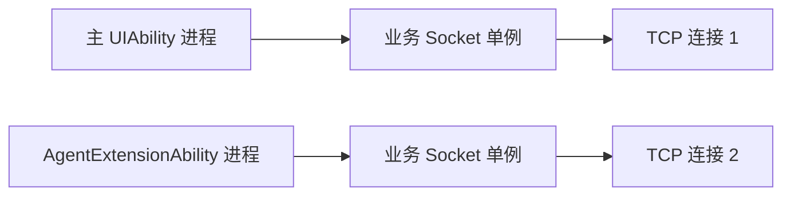
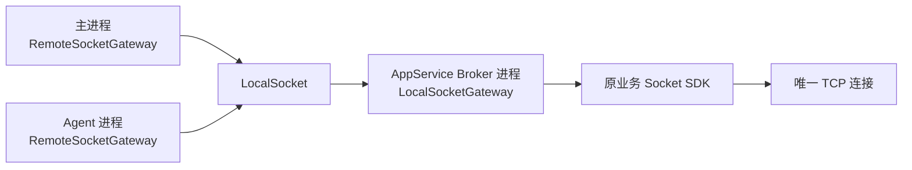
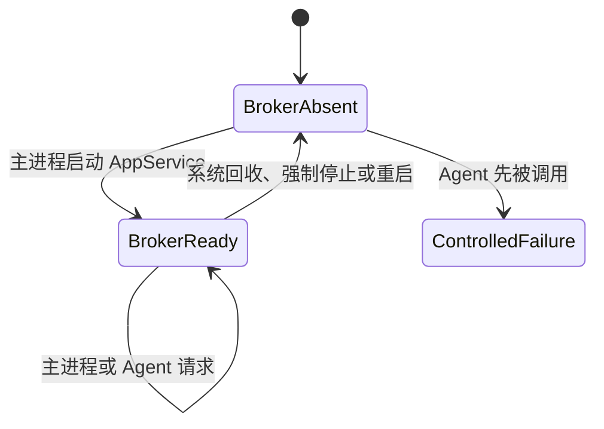

在 HarmonyOS 应用中，主 `UIAbility`、`AgentExtensionAbility` 和后台服务可以运行在不同进程。如果主进程与 Agent 进程都直接初始化网络 SDK，即使使用同一个单例类，也会分别创建 Socket。进程拥有独立的 ArkTS 运行时、静态变量和 Native 库实例，单例的有效范围只覆盖当前进程。

对于「三个进程共用一条长连接」的需求，可以采用一套应用层方案：由独立的 `AppServiceExtensionAbility` 进程担任 Broker，统一持有网络 SDK 和 TCP 连接；主进程与 Agent 进程通过 `LocalSocket` 访问 Broker；调用侧再增加一层 Gateway，保持原有业务接口基本稳定。

这套结构适合复用既有网络 SDK，同时把连接、登录、重连和推送集中到一个进程管理。它也受到 HarmonyOS 组件启动权限和进程生命周期的约束，需要在设计阶段明确 Broker 的启动方式与不可用时的处理策略。

## 适用场景

典型应用包含两个业务入口：

- 主 `UIAbility` 承载完整业务，并使用用户登录态；
- `AgentExtensionAbility` 在独立进程中提供轻量查询能力；
- 两个入口可能同时存活，都需要访问同一套长连接协议；
- 现有网络 SDK 已经稳定，希望通过外层适配完成多进程接入。

如果两个进程各自调用网络 SDK，运行结构如下：



这里的两个单例都符合各自进程内的约束。由于地址空间互相隔离，Native 网络库会初始化两次，服务端也会识别出两个独立客户端。

## 三进程方案

连接所有权可以集中到独立的 AppService Broker 进程：



三个进程的职责可以划分为：

| 进程 | 组件 | 职责 |
| --- | --- | --- |
| 主进程 | `RemoteSocketGateway` | 启动或连接 Broker，发送业务请求，接收响应与推送 |
| Agent 进程 | `RemoteSocketGateway` | 连接已运行的 Broker，访问允许开放的业务方法 |
| AppService Broker 进程 | `LocalSocketGateway` | 初始化网络 SDK，维护唯一 TCP 连接、登录态、重连和订阅 |

原网络 SDK 无需感知多进程。它继续在 Broker 内按原方式工作，只需确保主进程和 Agent 进程不再直接执行 SDK 初始化。

调用侧统一依赖 `SocketGateway`。进程内实现与远程实现遵循同一接口，业务代码无需关心请求最终由本地 SDK 处理，还是经由 `LocalSocket` 转发。

```typescript
interface SocketGateway {
  sendMessageForResult(
    service: number,
    method: number,
    body: Uint8Array | null,
    timeout?: number
  ): Promise<RootMessage>

  isConnected(): Promise<boolean>
  isLoggedIn(): Promise<boolean>
  autoLogin(): Promise<void>
  addPushListener(listener: PushListener): string
  removePushListener(listenerId: string): void
}
```

Broker 使用 `LocalSocketGateway` 直接调用网络 SDK。其他进程使用 `RemoteSocketGateway`，将请求编码后发送给 `LocalSocketServer`。所有网络入口都经过 Gateway，才能持续满足单连接约束。

## 组件与进程约束

### Agent 与主 UIAbility 的启动关系

系统调用 `AgentExtensionAbility` 时，会启动对应的扩展组件进程。这个动作不会自动创建主 `UIAbility`。

如果 Agent 连接主进程监听的 `LocalSocket`，而主进程尚未运行，连接会直接失败。`LocalSocket` 地址只用于进程间通信，系统不会根据该地址查找并启动某个 `UIAbility`。

### Context 能力范围

`UIAbilityContext` 提供启动和连接 `AppServiceExtensionAbility` 的接口。`AgentExtensionContext` 继承自更基础的 `ExtensionContext`，当前公开 API 没有提供等价的 AppService 连接能力，也不适合通过类型强制转换复用 UIAbility 的调用代码。

因此，标准 AbilityKit 启动入口位于主进程：

```text
UIAbility ---- connectAppServiceExtensionAbility() ----> AppService
AgentExtensionAbility ---- LocalSocket ----> 已运行的 AppService
```

Agent 可以通过 `LocalSocket` 访问已经运行的 Broker。Broker 尚未运行时，这次连接无法承担启动职责。

### 子进程创建限制

HarmonyOS 提供 ArkTS 和 Native 子进程能力，官方开发指南要求由主进程创建子进程。这类能力适合隔离计算或 Native 工作，无法覆盖「主进程尚未运行时，由 Agent 创建公共 Broker」的需求。

主进程提前创建子进程时，还需要单独验证父进程退出后的生命周期。对需要独立承载长期连接的组件，AppService 的能力边界更加清晰。

### AppService 生命周期

`AppServiceExtensionAbility` 可以在主 `UIAbility` 退出后继续运行，系统仍可能挂起或回收对应进程。设备重启、应用被强制停止或 Broker 被回收后，Agent 无法自行恢复 Broker。

因此，这套三进程方案提供的是「多个应用进程同时存活时，共用一条连接」。Agent 的全时可用性需要结合产品要求设计单独的降级或恢复机制。

## IPC 数据边界

网络封装中常见的泛型解析接口通常包含进程内函数：

```typescript
sendMessageForBodyResult<T>(
  service: number,
  method: number,
  body: Uint8Array,
  parser: (bytes: Uint8Array) => T
): Promise<T>
```

其中的 `parser` 无法跨进程传输。Broker 可以返回原始响应字节，由客户端进程执行 `fromBinary()`，这样既能保持 IPC 协议稳定，也能继续复用现有解析代码。

本地 IPC 协议只承载可序列化数据：

```text
version | type | requestId | service | method | timeout | bodyLength | body
```

协议至少覆盖请求、响应、错误、连接状态、登录状态、订阅和推送。`requestId` 用于匹配并发请求；每一帧都携带 `bodyLength`，用于处理 `LocalSocket` 数据流中的拆包和粘包。

Broker 负责以下工作：

- 维护请求 ID 与等待中的 Promise；
- 客户端断开时清理未完成请求和订阅；
- 统一处理登录、退出、网络切换与自动重连；
- 把推送广播给已订阅的进程；
- 限制 Agent 可调用的业务协议，控制共享登录态后的权限范围。

## 登录态设计

主进程可能使用用户账号，Agent 原先则使用游客账号。一条物理连接通常只能维持一种登录身份，除非服务端协议明确支持单连接多会话。

一种直接的处理方式是由 Broker 维护当前应用登录态：本地存在有效用户状态时使用用户会话，其余情况使用游客会话。Agent 共享当前连接，同时只能访问公开数据对应的方法集合。

登录密码无需通过 `LocalSocket` 在多个进程之间传递。Broker 可以读取同一应用沙箱内的持久化用户状态并执行 `autoLogin()`，主进程只发送「重新登录」或「退出」命令。

## Broker 生命周期与降级策略

Broker 的运行状态决定了两个调用端的可用性：



若应用要求始终保持最多一条 Socket，Agent 在 Broker 缺席时应返回明确的不可用结果。主进程启动 Broker 后，Agent 再通过 `LocalSocket` 重试。这样可以避免 Agent 临时创建连接后，主进程又建立第二条连接。

若产品要求 Agent 在主应用从未启动时仍可用，则需要扩展设计，例如允许 Agent 建立游客连接并实现连接所有权交接，或引入具备更高进程管理权限的系统级能力。此类方案会增加状态迁移、并发连接和权限管理成本，应作为另一种产品约束单独评估。

## 实施顺序

建议先建立最小平台原型，确认组件与进程行为，再迁移业务网络调用。原型需要验证以下事实：

1. 主 `UIAbility` 能启动 AppService Broker；
2. 主进程和 Agent 都能连接同一个 `LocalSocket` 地址；
3. 关闭主界面后，Broker 在目标设备上仍能处理请求；
4. Broker 被终止后，主进程能够重新启动它；
5. 主进程尚未运行时，Agent 能收到可识别的连接失败；
6. 进程列表中存在三个 PID，服务端方向只有一条 TCP 连接。

平台行为验证通过后，可以按以下顺序迁移：

1. 将网络 SDK 初始化和连接管理迁入 Broker；
2. 建立请求、响应与错误帧，接通一个只读接口；
3. 增加登录状态、超时与重连处理；
4. 增加订阅、推送广播与客户端退出清理；
5. 将主进程和 Agent 的旧调用逐步切换到 `SocketGateway`；
6. 在目标设备上核对进程、连接数量和生命周期行为。

对于需要兼容旧系统版本的应用，Gateway 可以按系统能力选择进程内实现或远程实现，业务接口保持一致。

## 设计检查清单

方案评审时可以逐项确认：

- 唯一连接所有者及其进程已经明确；
- 其他进程已经移除直接初始化网络 SDK 的入口；
- Broker 的启动方具备所需的 Context API；
- Broker 被系统回收后的恢复责任已经确定；
- 主进程未运行时，Agent 的失败、降级或临时连接策略已经确定；
- 登录态共享规则与 Agent 方法权限已经确定；
- 推送、超时、并发请求和客户端退出都有对应处理；
- 设备侧可以验证三个 PID 和唯一目标 TCP 连接。

这套方案把 Socket 的创建与生命周期集中到 Broker，并通过 Gateway 保持业务调用方式稳定。完成平台原型后再迁移业务接口，可以尽早确认 AppService 启动权限、进程回收和 Agent 降级行为，避免在大范围改造后才暴露平台边界。

## 参考资料

- [AgentExtensionAbility 组件](https://developer.huawei.com/consumer/cn/doc/harmonyos-guides/agent-extension-ability)
- [使用 AppServiceExtensionAbility 实现后台服务](https://developer.huawei.com/consumer/cn/doc/harmonyos-guides/app-service-extension-ability)
- [Native 子进程开发指南](https://developer.huawei.com/consumer/cn/doc/harmonyos-guides/capi-nativechildprocess-development-guideline)
- [Socket API 参考](https://developer.huawei.com/consumer/cn/doc/harmonyos-references/js-apis-socket)
