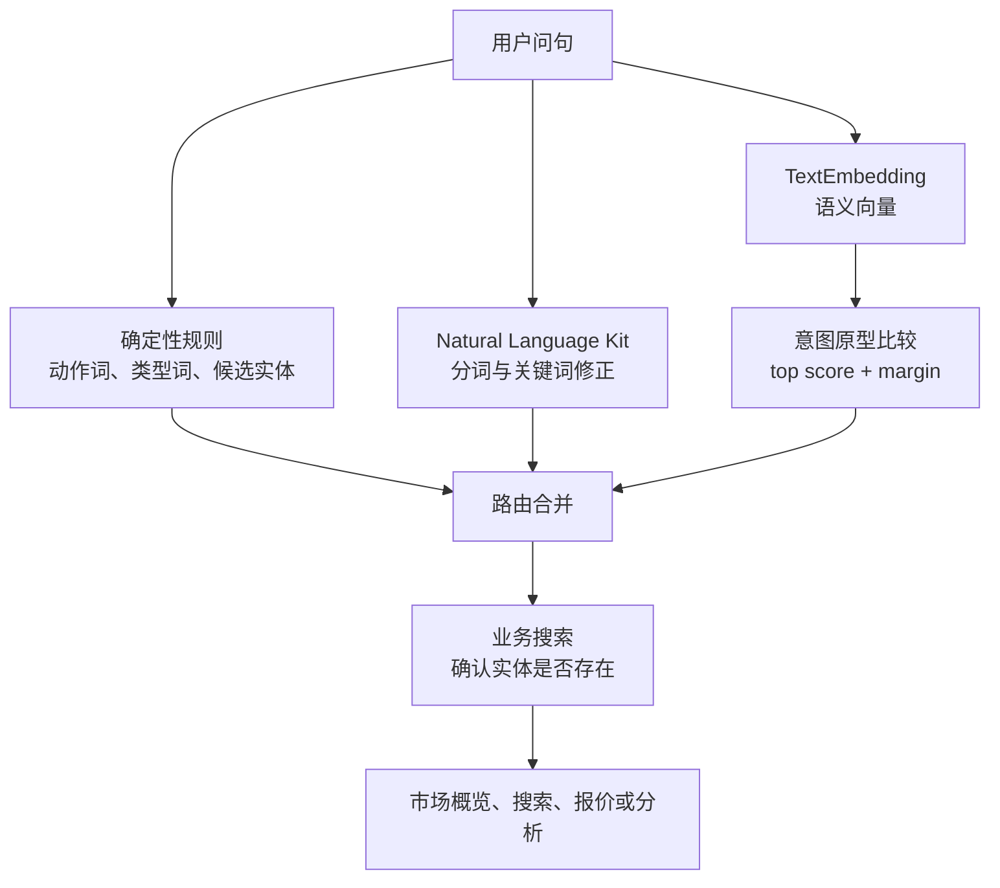

在应用内智能体中，用户很少按照预设模板提问。「今天市场怎么样」「查一下某证券」「分析一下它的走势」看起来都与行情有关，但它们对应的是市场概览、证券搜索和个体分析三条不同的业务路径。

只靠关键词规则时，「今天股票怎样」可能被清洗成一个不存在的证券名称；接入 Natural Language Kit 做分词后，文本结构会更清楚，但分词结果仍不会直接告诉应用应该调用哪个业务能力。把所有判断交给向量模型也不稳：相似度最高不等于结果足够可信，模型还可能在部分设备上不可用。

这次实践得到的核心结论是：**端侧模型适合增强意图判断，不适合替代确定性规则和业务实体校验。** 更稳妥的实现由三层组成：规则负责确定性信息，Natural Language Kit 负责文本特征处理，TextEmbedding 负责补充语义分类，最终结果仍由业务搜索确认。

本文代码是从实际实现中提取的脱敏示意代码，省略了协议、日志和具体业务服务，不应直接视为完整 SDK 示例。

## 先区分三个不同问题

「理解一句话」在工程中通常包含三个问题：

1. 用户想执行什么动作，例如搜索、查询报价或查看分析；
2. 用户提到了什么对象，例如某个证券、基金或整个市场；
3. 当前设备和业务数据能否支持这个动作。

这三个问题不能由同一个分类结果包办。语义模型可以判断一句话更接近「市场概览」还是「个体分析」，但它不知道某个名称是否真实存在，也不应擅自把已经识别出的证券改成基金。

因此，最终调用关系采用分层结构：



这里最重要的边界是：**语义分类决定调用模式，业务搜索决定实体是否成立。**

## 能力边界与版本要求

这套方案同时使用了三类 HarmonyOS 能力，它们解决的问题不同。

### AgentExtensionAbility

`AgentExtensionAbility` 是应用内智能体的运行入口，可以接收 Agent 服务发送的数据，并通过宿主代理返回结果。本机 HarmonyOS SDK 声明将该组件标记为 API 24 起支持。

因此，只要功能入口依赖 `AgentExtensionAbility`，整条应用内智能体路径的实际最低设备边界就是 API 24。即使后面使用的某项能力支持更早版本，也不会降低这条路径的最低要求。

### Natural Language Kit

Natural Language Kit 提供分词等自然语言处理能力。分词可以把连续文本拆成更稳定的词语，便于删除语气词、识别主题词和修正候选关键词。

它不是生成式模型，也不会根据一组业务标签自动完成意图分类。调用 `getWordSegment()` 后，应用拿到的仍是词语结果，后续判断需要由业务代码完成。

### ArkData TextEmbedding

ArkData 的 `TextEmbedding` 可以把中文或英文文本转换为向量。语义接近的句子通常在向量空间中更接近，因此可以用来比较用户问句与预设意图样本。

本机 SDK 声明显示该能力从 API 15 开始提供，单次推理最多处理 512 个字符，并可能返回错误码 `801`，表示当前设备不支持该能力。应用内智能体虽然运行在 API 24 设备上，仍必须处理 `801`，不能把系统版本满足要求等同于模型一定可用。

## 定义少量、互斥的意图

意图标签不宜按页面或接口无限扩张。标签越接近，向量越难拉开差异，后续阈值也越难校准。

一个行情类智能体可以先保留以下五类：

```typescript
enum SemanticIntentKind {
  MARKET_OVERVIEW = 'market_overview',
  QUOTE = 'quote',
  ANALYSIS = 'analysis',
  SECURITY_SEARCH = 'security_search',
  FUND_SEARCH = 'fund_search',
  UNKNOWN = 'unknown'
}
```

每类准备若干自然问句作为原型样本：

| 意图 | 脱敏样本 |
| --- | --- |
| 市场概览 | `今天市场怎么样`、`主要指数表现如何` |
| 实时报价 | `某证券最新价`、`播报当前行情` |
| 个体分析 | `分析某证券走势`、`这个标的表现如何` |
| 证券搜索 | `搜索某证券`、`查找证券代码` |
| 基金搜索 | `搜索某类基金`、`查找基金代码` |

样本应该描述用户真实说法，而不是接口名称。每类只有一条样本时，单句中的偶然措辞会直接影响整个类别；准备多条样本并取平均向量，结果通常更稳定。

## 初始化模型并缓存原型向量

模型不应在每次请求中重新加载，固定样本也不应重复计算。可以在第一次分类时延迟初始化，用同一个 Promise 合并并发初始化，再批量计算样本向量。

```typescript
import { intelligence } from '@kit.ArkData'

class SemanticIntentService {
  private model: intelligence.TextEmbedding | undefined = undefined
  private initialization: Promise<boolean> | undefined = undefined
  private prototypes: SemanticPrototype[] = []
  private released: boolean = false

  private async ensureInitialized(): Promise<boolean> {
    if (this.released) {
      return false
    }
    if (!this.initialization) {
      this.initialization = this.initializeModel()
    }
    return await this.initialization
  }

  private async initializeModel(): Promise<boolean> {
    let candidate: intelligence.TextEmbedding | undefined = undefined
    try {
      const config: intelligence.ModelConfig = {
        version: intelligence.ModelVersion.BASIC_MODEL,
        isNpuAvailable: false
      }
      candidate = await intelligence.getTextEmbeddingModel(config)
      await candidate.loadModel()

      const embeddings = await candidate.getEmbedding(PROTOTYPE_TEXTS)
      const prototypes = buildPrototypes(PROTOTYPE_KINDS, embeddings)
      if (prototypes.length === 0 || this.released) {
        await candidate.releaseModel()
        return false
      }

      this.model = candidate
      this.prototypes = prototypes
      return true
    } catch (error) {
      if (candidate) {
        candidate.releaseModel().catch(() => {})
      }
      return false
    }
  }
}
```

生产实现还需要记录错误码和耗时，但不要因为模型初始化失败而让 Agent 请求整体失败。初始化失败只表示语义增强暂时不可用，规则路径仍然可以继续工作。

## 使用 top score 和 margin 判断置信度

拿到问句向量后，可以用余弦相似度与每个意图原型比较：

\[
\cos(\theta) = \frac{A \cdot B}{\lVert A \rVert \lVert B \rVert}
\]

仅选择最高分还不够。假设「报价」得分为 `0.76`，「分析」得分为 `0.75`，最高分看起来不低，但两个结果几乎无法区分。此时强制选择报价会制造一个看似确定的错误。

分类器需要同时满足两个条件：

- 最高分达到最低相似度；
- 第一名与第二名的差值达到最低 margin。

```typescript
class SemanticThresholds {
  minimumScore: number
  minimumMargin: number

  constructor(minimumScore: number, minimumMargin: number) {
    this.minimumScore = minimumScore
    this.minimumMargin = minimumMargin
  }
}

function decideIntent(scores: IntentScore[], thresholds: SemanticThresholds): SemanticIntentKind {
  scores.sort((left: IntentScore, right: IntentScore) => right.score - left.score)
  if (scores.length < 2) {
    return SemanticIntentKind.UNKNOWN
  }

  const top = scores[0]
  const margin = top.score - scores[1].score
  if (top.score < thresholds.minimumScore || margin < thresholds.minimumMargin) {
    return SemanticIntentKind.UNKNOWN
  }
  return top.kind
}
```

例如可以从 `minimumScore = 0.60`、`minimumMargin = 0.04` 开始实验，但这不是通用推荐值。正式阈值应根据真实问句的分数分布校准，并重点观察误路由，而不只是整体命中率。

## Natural Language Kit 放在哪一层

Natural Language Kit 更适合处理关键词，而不是替代意图分类器。一个简化流程如下：

```typescript
const segments = await textProcessing.getWordSegment(query)
const words: string[] = []
for (const segment of segments) {
  words.push(segment.word)
}

const keyword = removeActionWordsAndParticles(words)
const marketTopic = containsMarketTopic(words)
```

分词后的结果可以承担两项工作：

- 当规则提取出的实体没有搜索结果时，提供一个修正后的候选关键词；
- 当关键词已经为空，同时存在市场主题词时，辅助进入市场概览。

如果分词初始化或执行失败，应返回规则提取的关键词，而不是中断请求。这样一来，Natural Language Kit 与 TextEmbedding 都属于增强层，任何一层失败都不会破坏最基本的搜索和查询能力。

## 合并路由时保护业务实体

语义结果不能无条件覆盖规则结果。更安全的合并规则包括：

1. 低置信语义结果统一视为 `UNKNOWN`，保留规则意图；
2. 语义结果可以在搜索、报价和分析之间调整动作；
3. 已由规则识别出的基金属性不能被语义结果改成证券；
4. 「市场概览」只有在没有有效实体时才能生效；
5. 最终实体由真实业务搜索确认。

```typescript
const ruleIntent = classifyByRules(query)
const language = await naturalLanguageService.analyze(query, ruleIntent.keyword)
const semantic = await semanticIntentService.classify(query)
const mergedIntent = mergeIntent(ruleIntent, semantic)

let results = await searchEntity(mergedIntent.keyword, mergedIntent.entityType)
if (results.length === 0 && language.keyword !== mergedIntent.keyword) {
  results = await searchEntity(language.keyword, mergedIntent.entityType)
}

const routeToMarket = semantic.kind === SemanticIntentKind.MARKET_OVERVIEW &&
  results.length === 0
```

这条规则解决了一个常见冲突：某个问句在语义上很像「市场怎么样」，但其中确实包含一个有效证券名称。只要业务搜索找到了实体，就应进入个体行情，而不是展示整个市场。

同样，向量模型可能把「搜索某基金」判断为普通证券搜索。只要确定性规则已经识别出「基金」，语义分类就只能调整动作，不能改变实体域。

## 模型生命周期与失败处理

Agent 组件通常在独立进程中运行，模型实例和初始化 Promise 都只属于当前进程。生命周期处理至少覆盖以下情况：

- 首次请求触发模型加载；
- 多个请求同时到达时只初始化一次；
- 初始化过程中组件被销毁；
- `getTextEmbeddingModel()`、`loadModel()` 或 `getEmbedding()` 抛出异常；
- 当前设备返回 `801`；
- 组件销毁时释放模型。

```typescript
release(): void {
  this.released = true
  const pending = this.initialization
  if (!pending) {
    this.releaseLoadedModel()
    return
  }

  pending.then(() => {
    this.releaseLoadedModel()
  }).catch(() => {})
}
```

异常路径的统一返回值应是 `UNKNOWN`，而不是另一个猜测出来的意图。`UNKNOWN` 表示「语义层不参与本次决策」，随后继续使用规则和业务校验结果。

## 如何验证这套方案

测试应拆成纯算法、路由和设备能力三层。

### 纯算法测试

余弦相似度不需要真实模型。使用二维或三维向量就能覆盖关键边界：

- 最高分和 margin 都足够时选择最近意图；
- 最高分不足时返回 `UNKNOWN`；
- 前两名过于接近时返回 `UNKNOWN`；
- 向量维度不一致或零向量时返回 `UNKNOWN`。

### 路由测试

路由测试不依赖设备模型，重点验证业务约束：

- 低置信语义结果不改变规则意图；
- 语义结果改变动作时不改变已提取实体；
- 基金实体不会被切换到证券搜索；
- 有效实体不会被市场概览覆盖。

### 真机测试

真机验证需要同时观察功能结果和模型日志：

1. 在 API 24 设备上触发 Agent 请求；
2. 确认模型只初始化一次；
3. 分别测试市场概览、实体搜索、报价、分析和模糊问句；
4. 记录 top score 与 margin，形成阈值样本；
5. 在不支持模型或返回 `801` 的设备上确认规则路径仍可工作；
6. 销毁 Agent 组件，确认模型执行释放。

编译成功和 HAP 安装成功只能证明代码进入产物，不能证明目标设备实际执行了 TextEmbedding 分支。只有观察到初始化、推理结果和降级路径后，才能把端侧模型标记为运行时已验证。

## 容易出现的四个误区

### 把分词当成意图识别

分词解决的是文本如何拆开，不是业务应该调用哪个能力。没有业务标签、样本和路由规则时，分词结果不会自动变成可执行意图。

### 只看相似度第一名

第一名可能只是「几个低分结果中最高的一个」，也可能与第二名几乎相同。最低分和 margin 缺一不可。

### 让语义结果覆盖实体

向量适合判断动作相似度，真实业务搜索更适合确认对象。实体校验应保持权威，否则一个错误分类会把请求带入错误的数据域。

### 把系统版本当成能力可用证明

API 版本只说明接口可以调用，不代表每台设备都具备模型能力。错误码 `801` 必须进入可预期的降级路径。

## 可复用的判断原则

端侧语义能力接入业务路由时，可以保留三条原则：

- **确定性信息优先。** 明确的实体类型、代码和业务搜索结果不交给模型覆盖。
- **不确定结果允许退出。** 低分或低 margin 时返回 `UNKNOWN`，比强行选择一个意图更安全。
- **增强能力必须可移除。** 关闭 Natural Language Kit 或 TextEmbedding 后，基础规则路径仍然能够完成最小功能。

这种分层方式不会让端侧模型替应用做全部判断，但能让规则难以覆盖的自然表达获得更合理的路由，同时把误判和设备差异限制在可控范围内。

## 参考资料

- [AgentExtensionAbility 组件](https://developer.huawei.com/consumer/cn/doc/harmonyos-guides/agent-extension-ability)
- [应用内 Agent2Agent 开发](https://developer.huawei.com/consumer/cn/doc/service/agent2agent-inapp-0000002630346158)
- [Natural Language Kit 简介](https://developer.huawei.com/consumer/cn/doc/harmonyos-guides/natural-language-introduction)
- [数据智能 API：TextEmbedding](https://developer.huawei.com/consumer/cn/doc/harmonyos-references/js-apis-data-intelligence)
