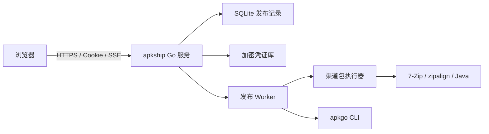

上一篇文章介绍了如何直接修改 APK 中的二进制 AXML，把渠道标识写回 `AndroidManifest.xml`。这个方法解决了「如何快速改一个值」，却没有解决另一个更容易出错的问题：改完之后，如何确认每个市场拿到的是正确 ABI、正确签名、正确渠道标识的 APK，并且在某个市场失败时可以单独恢复？

`apkship` 的核心判断是：**渠道打包的交付对象是一条经过规划、构建、验真、预检和上传的发布流水线。** AXML 修改只是其中一环，最终正确性要由产物反读、文件摘要和目标状态共同证明。

## apkship 的项目边界与整体架构

`apkship` 是运行在 macOS 或 Linux 上的单用户内网 Web 工具。它接收已经构建好的基础 APK，负责生成市场需要的渠道包、执行上传前预检、发起正式上传，并保存每次发布的产物和状态。当前版本把 Android 源码的 Gradle 构建、商店截图和资质材料交给上游流程处理。

项目只有一个 Go 服务进程，页面模板和静态资源直接嵌入二进制；SQLite 保存发布记录，APK 和日志保存在数据目录，外部工具通过受控子进程调用：



这里的 `SSE` 是 Server-Sent Events，作用是让浏览器接收后台任务的进度更新；后台任务由服务端的 worker 负责，浏览器关闭后仍可以继续运行。`apkship` 管理发布任务和产物，`apkgo` 管理具体的市场接口，两者通过一个明确的适配层连接。

## 一次发布在项目中如何流动

从操作者的视角，一次发布依次经过六个阶段：

1. 使用 `apkship init` 创建数据目录、主密钥和管理员账号；在凭证页面配置签名材料及各市场凭证。
2. 在「新建发布」页面上传一个基础 APK，或按市场需求上传多 ABI 输入，并填写版本说明。
3. `internal/release/service.go` 检查 APK 元数据，创建 release、artifact 和市场 target 记录；此时还没有生成渠道包。
4. 执行准备操作后，worker 按市场计划生成渠道包并调用 `apkgo upload --dry-run` 预检，只有准备就绪的目标才进入正式上传。
5. 正式上传前再次输入管理员密码；可以一次上传所有就绪目标，也可以只上传某一个市场。
6. 在发布详情页查看每个市场的进度、产物摘要、上传尝试和脱敏日志；失败市场可以按规则恢复，未知结果不会被程序自动重试。

常用的运行入口只有以下几条命令：

```bash
./bin/apkship init --data-dir "$HOME/.apkship" --username admin
PATH="$PWD/bin:$PATH" ./bin/apkship doctor
./bin/apkship serve \
  --data-dir "$HOME/.apkship" \
  --listen 127.0.0.1:8787 \
  --apkgo "$PWD/bin/apkgo"
```

`doctor` 会在服务启动前检查 `apkgo`、渠道包目录、7-Zip、`zipalign` 和 Java。默认只监听回环地址；需要在内网地址提供服务时，必须配置 TLS，除非明确开启不安全的 HTTP 模式。该设计将运行环境和发布前置条件尽量前置到启动阶段检查。

## 数据和凭证是项目方案的一部分

`apkship` 选择 SQLite 持久化任务状态和文件关系，不依赖 Redis 或独立任务服务。核心实体可以按下面的关系理解：

| 实体 | 记录内容 | 作用 |
| --- | --- | --- |
| `releases` | 包名、版本、说明和总体状态 | 一次发布的主记录 |
| `artifacts` | 文件路径、类型、大小、SHA-256 和保留时间 | 基础 APK 或渠道 APK |
| `release_targets` | 市场、渠道标识、当前状态和诊断 | 每个市场的独立进度 |
| `release_target_packages` | `primary`、`file64`、ABI 和期望渠道标识 | 多 ABI 上传计划 |
| `upload_attempts` | 开始/结束时间、结果和诊断日志 | 每次市场上传尝试 |
| `audit_events` | 登录、配置、确认和重试等操作 | 安全审计 |

文件内容不直接写入数据库，数据库只保存受控路径和摘要。这样既能在页面中展示「本次上传的实际文件」，也能在服务重启后重新检查文件是否仍然存在、摘要是否一致。

凭证采用独立存储路径：管理员密码只保存 Argon2id 哈希；市场凭证和签名配置用主密钥加密后写入 SQLite；主密钥默认位于 `~/.apkship/master.key`，权限为 `0600`。签名密码通过标准输入传给签名工具，市场凭证通过 `apkgo` 的专用文件描述符传递，页面和命令行参数都不显示凭证明文。

因此，`apkship` 还需要在打包器之外负责会话、CSRF、文件路径、审计、并发和恢复。打包器只处理 APK；安全和任务层负责决定什么时候可以调用它，以及失败后下一步是什么。

## 先把市场差异放进模型

如果把所有市场都当成「一个渠道标识对应一个 APK」，打包脚本很快会出现分支堆积。`apkship` 先在 `internal/model/multi_apk.go` 中定义每个市场需要的上传槽位、ABI 变体和渠道标识，再由后面的 worker 执行这个计划。

当前发布模型的规则如下：

下面的市场名称、渠道标识和配置文件路径均为脱敏占位符，不对应真实生产值。

| 市场 | 主上传包 | `file64` | 渠道标识 | 是否改包 |
| --- | --- | --- | ---: | --- |
| 市场 A（原包透传） | `arm32_arm64` 原包 | `arm64` 原包 | - | 否 |
| 市场 B | `arm64` 渠道包 | - | `channel-a` | 是 |
| 市场 C | `arm32` 渠道包 | `arm64` 渠道包 | `channel-b` | 是 |
| 市场 D | `arm32` 渠道包 | `arm64` 渠道包 | `channel-c` | 是 |
| 市场 E | `arm64` 渠道包 | - | `channel-d` | 是 |
| 市场 F | `arm64` 渠道包 | - | `channel-e` | 是 |

渠道标识和文件名的映射来自渠道配置文件，实际路径和映射值在本文中省略。市场 A 是一个重要的例外：它复用未修改的基础 APK，不经过渠道注入、重建、对齐和重新签名。

这个表承担的是实际的输入约束，展示层只负责把它呈现出来。`TargetPackagePlanForStore` 根据市场返回计划，`RequiredAPKVariants` 再计算本次发布必须上传哪些 ABI 文件。市场规则集中在一个地方后，打包器只需要处理「给定输入和渠道标识，产出一个经过验证的 APK」。

## 发布入口先完成 APK 检查

发布入口在 `internal/release/service.go` 和 `internal/release/service_multi.go`。上传的 APK 会先经过 `internal/apk/inspect.go`：读取包名、版本名、版本号、ABI 和 SHA-256。

多 ABI 发布还会执行两类一致性检查：

1. 上传的 ABI 变体必须是所选市场实际需要的变体，不能少传，也不能多传无关文件。
2. 各变体的包名、版本名和版本号必须与 `arm64` 基准包一致。

这一步拦截的是「输入本身不适合发布」的问题。假如一个市场需要 32 位和 64 位两个包，却只上传了 64 位包，继续执行到上传阶段才发现，错误就会以市场接口失败的形式出现，难以区分输入问题与上传问题；在入口处检查，责任边界更清楚。

创建发布后，基础 APK 会被移动到 `dataRoot/artifacts/<releaseID>/`，数据库同时保存文件类型、路径、大小和 SHA-256。后续生成的渠道包也会以独立 artifact 记录，不依赖临时目录的文件名猜测结果。

## AXML 修改仍然是核心，但只负责一件事

在上一篇文章里，示例使用 Python 直接覆盖 AXML 属性中的 4 个字节。`apkship` 保留了同样的底层思路，但实现位于 `internal/apk/axml.go`，并且把解析和错误处理纳入 Go 代码。

实际使用的元数据键名不在文章中展开，以下统一用 `<渠道元数据键>` 表示。`PatchChannel` 会：

1. 校验渠道标识必须在 `0` 到 `math.MaxUint32` 范围内；
2. 解析 XML 头、字符串池和每个 `START_TAG`；
3. 找到对应的 `meta-data` 节点；
4. 将 `value` 的类型设为十进制整数，并写入新的 4 字节数值；
5. 把原始字符串引用设为无效，避免继续指向旧值。

`ReadChannel` 支持读取整数、十六进制整数和字符串形式的值。这样做的意义不只是兼容旧 APK，更重要的是：构建结束后可以用同一个解析器从最终产物反读渠道标识。

打包器调用顺序可以概括为下面的示意代码，字段名已做脱敏处理，实际实现还包含每一步的错误处理和临时文件清理：

```go
manifest, err := ReadManifest(request.SourcePath)
if err != nil {
    return err
}
manifest, err = PatchChannel(manifest, request.ChannelValue)
if err != nil {
    return err
}

// 之后才是 APK 重建、zipalign、签名和产物回读。
```

这里需要区分两个证据层次：AXML 解析成功只能说明「内存中的 manifest 已经改对」，重建后的 ZIP 可安装、签名有效以及市场上传可通过，仍需后续步骤分别验证。

## APK 重建需要维护 ZIP 与资源约束

`internal/apk/package.go` 提供 Go 实现的 ZIP 重建，`internal/apk/package_rebuild_7zip.go` 提供使用 7-Zip 的重建路径。两条路径都遵循同一组约束：只替换 `AndroidManifest.xml`，其余条目尽量保留原始元数据，并拒绝绝对路径和 `../` 路径。

项目还处理了 Android APK 中常见且容易被忽略的一类问题：资源路径大小写冲突。某些 APK 同时包含 `res/Icon.xml` 和 `res/icon.xml`，在大小写不敏感的文件系统上解压会发生覆盖。`planCaseInsensitiveResourceRenames` 会为冲突的 `res/` 条目生成同长度的新名字，并同步改写 `resources.arsc` 中的路径；无法安全改名时直接阻止构建。

压缩策略按条目类型区分。`internal/apk/zip_policy.go` 将普通条目使用 Deflate，而 `resources.arsc`、指定 GIF 和 MP3 使用 Store。7-Zip 路径会先排除这些条目，再以 `-mx=0` 单独加入，最后运行一次 ZIP 测试确认归档可读。

因此，上一篇文章中的 `unzip + zip` 四步脚本适合作为底层动作示例；生产方案还需要同时维护资源路径、压缩方式和 ZIP 结构，因为文件内容改对只是必要条件。

## 对齐和签名纳入构建流程

`BuildChannel` 在重建后固定执行以下顺序：

```text
读取基础 APK
    -> 解析并修改 <渠道元数据键>
    -> 重建 APK
    -> zipalign -p -f 4
    -> uber-apk-signer-1.3.0.jar
    -> 查找唯一签名输出
    -> 从最终 APK 反读渠道标识
    -> 计算 SHA-256
```

签名材料来自 Web 控制台保存的加密凭证。`internal/command/serve.go` 的 `runtimePackager` 在开始批次时读取签名配置，并将 store password 和 key password 通过标准输入传给签名工具，不把密码放进进程参数。

签名工具的输出也有明确契约：临时目录中必须恰好找到一个 `*_aligned-aligned-signed.apk`。找不到或找到多个文件都会失败，避免「命令退出码为 0，但程序选错文件」这种隐蔽错误。

7-Zip、`zipalign` 和 Java 都是外部进程。当前实现给每个命令设置统一的最长执行时间；在 Unix 上还会把子进程放入独立进程组，超时后连同子进程树一起终止。这样可以处理压缩命令长时间运行和子进程残留的问题。

## 产物必须证明自己是目标渠道

生成成功后，`BuildChannel` 会调用 `ReadChannelFromAPK` 重新打开最终 APK，读取其中的脱敏元数据键，并与传入的渠道标识比较：

```text
期望标识 <目标值>
    -> 签名产物回读到标识 <实际值>
    -> 目标标记为 blocked
    -> 保留「built channel <实际值>, want <目标值>」诊断
```

只有回读一致，产物才会写入发布记录，并保存最终文件大小和 SHA-256。已有产物在重试或服务重启后也会再次执行渠道验证，避免只因为文件存在就跳过检查。

这是整套方案里最重要的验证动作：它把「构建过程认为自己做了什么」和「最终 APK 实际包含什么」分成两个证据来源。

## 状态机把失败留在正确的层级

`internal/release/worker_package.go` 和 `internal/release/worker_multi.go` 将打包过程放进每个市场目标自己的状态机：

```text
pending
   -> packaging
   -> preflighting
   -> ready
   -> uploading
   -> succeeded | failed | uncertain
```

渠道标识读取失败、渠道标识不匹配、签名缺失、ABI 产物缺失等问题会进入 `blocked`。这表示「渠道包生成或上传前预检没有通过」，修复输入或配置后可以重新准备。

正式上传返回明确失败时，目标进入 `failed`，可以查看上传日志并单市场重试。若外部市场可能已经受理请求，但本地没有收到明确终态，则进入 `uncertain`；这个状态禁止自动重试，必须先在市场后台或审核查询中确认结果。

市场 A 的原包透传也遵循同一状态模型，只是它的 `ArtifactKind` 是基础 APK，不会经过渠道打包。这样「是否需要改包」和「是否需要上传」不会混成一个布尔值。

## 预检和上传交给 apkgo

市场上传协议由 `apkgo` 负责，`apkship` 通过 `internal/apkgo/client.go` 调用本机的 `apkgo` CLI：

1. 先使用 `--dry-run` 执行市场预检；
2. 首次正式上传要求目标为 `ready`；明确失败的 `failed` 目标可以单市场重试；
3. 多 ABI 市场把 64 位包映射到 `--file64`；
4. 市场凭证通过专用文件描述符传递，不进入命令行参数；
5. 解析 NDJSON 进度和终态事件，保存脱敏后的诊断日志。

这条边界让两个项目承担明确职责：`apkship` 管理发布记录、产物、状态和恢复；`apkgo` 管理市场 API、凭证格式和上传协议。以后新增市场时，应优先增加 `apkgo` 适配器和 `TargetPackagePlanForStore` 规则，并让市场请求继续由上传适配层处理。

## 当前方案如何验证

这套流程的测试按职责边界分别覆盖：

- `go test ./internal/apk`：AXML 读写、渠道配置、ZIP 重建、资源路径改写、7-Zip 压缩策略、对齐和签名命令顺序、输出唯一性和最终渠道回读；
- `go test ./internal/model`：市场包计划、上传槽位和 ABI 分类；
- `go test ./internal/release`：渠道不匹配阻断、已有产物补验、重试重建和多 ABI 产物保存；
- `go test ./internal/apkgo`：凭证不泄露、`--file64` 参数、预检和 `uncertain` 结果。

在仓库当前状态下，上述核心包的测试已经通过。测试中使用了 fake `zipalign` 和 fake Java 签名工具，因此它们证明的是调用顺序、数据传递和状态转换；真实签名证书验证、设备安装验证和应用市场后台受理验证仍需在对应环境中完成。

## 结语：把「修改渠道标识」升级成可核对的交付物

上一篇文章解决的是底层动作：如何在不改字符串池大小的前提下修改 AXML 中的整数。`apkship` 在此之上补齐了生产流程真正需要的部分：

1. 先按市场计算 ABI 和上传槽位；
2. 在发布入口校验 APK 元数据和输入集合；
3. 只修改目标 AXML，重建时处理 ZIP、资源路径和压缩策略；
4. 经过 `zipalign` 和签名后，从最终 APK 反读渠道标识；
5. 保存文件摘要和诊断，把每个市场独立推进到预检和上传；
6. 对 `blocked`、`failed` 和 `uncertain` 使用不同的恢复规则。

可复用的判断标准是：**把判断从「脚本是否执行成功」转向「最终产物能否证明自己属于哪个市场、哪个 ABI、哪个版本，以及失败后能否只重试必要的那一部分」。**
